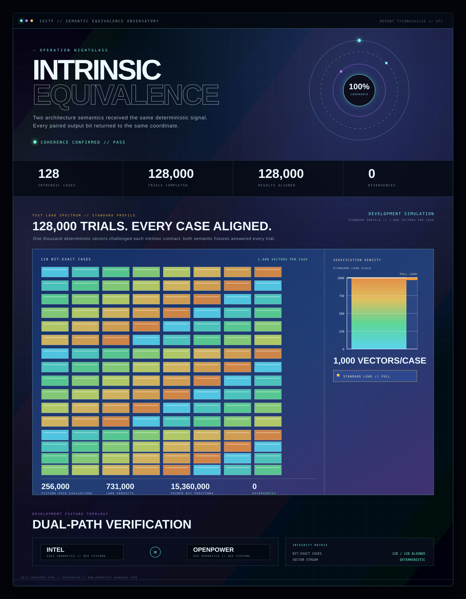

# intrinsics-equivalence

<p>
  
  
  
  
  <a href="LICENSE"></a>
</p>

**Intel Intrinsics と OpenPOWER の互換性・等価性を検証するためのテストフレームワーク**

同じ入力から結果の違いを見つけます。中ではかなり厳密に記録しますが、普段使う
コマンドは短くしてあります。

現在は算術、乗算、飽和算術、平均/SAD、論理、比較、shift、pack、レーン操作を含む
96ケースを収録しています。

> ローカル比較に加え、Clangによるx86_64 / ppc64le objectのcross buildまで動きます。
> 未実装なのはppc64le実機での実行と、結果をnative evidenceとして収集するrunnerです。

Original concept: [@daisukeokaoss](https://github.com/daisukeokaoss)

## まずは動かす

```sh
git clone https://github.com/yuna-r/intrinsics-equivalence.git
cd intrinsics-equivalence

python3 -m venv .venv
source .venv/bin/activate
python -m pip install -e .

ioitf check
```

最後に`"status":"pass"`が出れば成功です。

```json
{"case_count":96,"record_count":768,"status":"pass"}
```

実行中はvectors生成、Intel / OpenPOWER fixture、比較、レポート生成の進捗が表示されます。
進捗はstderr、最後のJSONはstdoutなので、スクリプトからもそのまま扱えます。
進捗を消したい場合だけ`ioitf check --quiet`を使います。

最後には、SFレポートを付けない普通の`ioitf check`でも検証メトリクスが表示されます。
件数は実際に指定したprofileとvectors数から計算されます。たとえばstandard runでは次の形です。

```text
Verification metrics
  cases                                          96
  trials                                     96,000
  implementation-path evaluations          192,000
  lane verdicts                             594,000
  bit positions                          12,096,000
  match rate                                   100%
  mismatch                                         0
```

この表もstderrへ出るため、stdoutの最終JSONは従来どおり1行のままです。

`ioitf check`ひとつで、caseの確認、入力生成、両側の実行、答え合わせまで進みます。
途中の記録は`.ioitf/checks/<timestamp>/`へ残ります。

> ここで動くのはローカル開発用fixtureです。CPU実機で一致した証拠ではありません。

## おまけ：SFレポート

ちょっと楽しいおまけとして、`--showcase-report`を付けると、いつもの成果物に
近未来SF風のHTMLレポートが加わります。プレビューと同じ高密度runはこの1コマンドです。



```sh
ioitf check --profile standard --count-per-case 1000 --showcase-report
```

96ケース × 1,000 vectorsで96,000 trials。両経路あわせて192,000 fixture evaluations、
594,000 lane verdicts、12,096,000 paired bit positionsを照合します。境界値や特殊値を含む
deterministic streamをどれだけ通したかは、レポートの矩形ロードグラフにも出ます。

実行結果の`showcase_report`が生成したファイルです。

```json
{"showcase_report":".ioitf/checks/.../showcase.html","status":"pass"}
```

外部画像やWebフォントを使わない1ファイル完結なので、そのままブラウザで開いたり
共有したりできます。

派手なのは見た目だけで、判定元はこれまでどおりcanonical JSON成果物です。

## IntelとOpenPOWERを見比べる

Repositoryの一番上に来る[`10_official_suite/`](10_official_suite/)へ、
96個のcontractと、Intel / OpenPOWERそれぞれの全96操作をまとめてあります。

| Intel Intrinsic | OpenPOWER / VSX |
|---|---|
| `_mm_add_pd(a, b)` | `vec_add(a, b)` |
| `_mm_cmpeq_pd(a, b)` | lane comparison + all-bits mask |
| `_mm_adds_epi16(a, b)` | `vec_adds(a, b)` |
| `_mm_subs_epu8(a, b)` | `vec_subs(a, b)` |
| `_mm_set1_pd(x)` | `vec_splats(x)` |
| `_mm_shuffle_epi32(v, 27)` | `{v[3], v[2], v[1], v[0]}` |

[`intel/`](10_official_suite/intel/)と[`openpower/`](10_official_suite/openpower/)を
左右対称にし、どちらもf64 / i8 / i16 / i32 / i64の5つの塊で置いてあります。

Clangのcross buildも1コマンドです。

```sh
./10_official_suite/cross-compile.sh
```

x86-64 ELFとOpenPOWER ELF V2 ABIのppc64le objectを同時に生成します。

## ケースをひとつ増やす

似ているケースをコピーします。

```sh
cp -R 10_official_suite/cases/add-f64x2 10_official_suite/cases/my-new-case
```

1ケースは、この小さな塊だけです。

```text
my-new-case/
├── case.yaml       # 名前、型、比較方法
└── development.py  # 入力と期待動作
```

2ファイルを直したら、いつものコマンドを実行します。

```sh
ioitf check
```

これでローカルのcase追加は完了です。中央の巨大なswitch文へcase IDを足す必要はありません。
実例は[`10_official_suite/cases/`](10_official_suite/cases/)にあります。

## 変更後の確認

普段はこの2つで大丈夫です。

```sh
ioitf check
python -m unittest discover -s tests -v
```

Native側を変更した場合だけ、Cのテストも実行します。

```sh
cmake -S . -B build/native -DBUILD_TESTING=ON -DCMAKE_BUILD_TYPE=Release
cmake --build build/native --parallel
ctest --test-dir build/native --output-on-failure
```

## 必要になったら開くところ

ここから先は、いま必要な項目だけどうぞ。

<details>
<summary><strong>収録している96ケース</strong></summary>

- f64 arithmetic: `_mm_add_pd`、`_mm_sub_pd`、`_mm_mul_pd`
- f64 bit / lane: `_mm_and_pd`、`_mm_or_pd`、`_mm_xor_pd`、`_mm_set1_pd`、
  `_mm_andnot_pd`、`_mm_move_sd`、`_mm_unpacklo_pd`、`_mm_unpackhi_pd`、
  `_mm_shuffle_pd`、`_mm_set_pd`、cast ×2、movemask
- f64 comparison: `_mm_cmpeq_pd`、`_mm_cmplt_pd`、`_mm_cmple_pd`、`_mm_cmpgt_pd`、
  `_mm_cmpge_pd`、`_mm_cmpneq_pd`、`_mm_cmpord_pd`、`_mm_cmpunord_pd`、
  `_mm_cmpnlt_pd`、`_mm_cmpnle_pd`、`_mm_cmpngt_pd`、`_mm_cmpnge_pd`
- i8 arithmetic / saturation / comparison: `_mm_add_epi8`、`_mm_sub_epi8`、
  `_mm_adds_epi8`、`_mm_adds_epu8`、`_mm_subs_epi8`、`_mm_subs_epu8`、
  `_mm_cmpeq_epi8`、`_mm_cmpgt_epi8`、`_mm_avg_epu8`、`_mm_sad_epu8`、
  `_mm_min_epu8`、`_mm_max_epu8`、byte shift ×2、unpack ×2、movemask
- i16 arithmetic / saturation / comparison: `_mm_add_epi16`、`_mm_sub_epi16`、
  `_mm_adds_epi16`、`_mm_adds_epu16`、`_mm_subs_epi16`、`_mm_subs_epu16`、
  `_mm_cmpeq_epi16`、`_mm_cmpgt_epi16`、mul ×3、`_mm_madd_epi16`、
  `_mm_avg_epu16`、min/max、shift ×3、unpack ×2、pack ×2、shuffle ×2
- i32 arithmetic / construction: `_mm_add_epi32`、`_mm_sub_epi32`、`_mm_mul_epu32`、
  `_mm_cvtsi32_si128`、`_mm_set1_epi32`
- i32 logic: `_mm_and_si128`、`_mm_or_si128`、`_mm_xor_si128`、`_mm_andnot_si128`
- i32 comparison: `_mm_cmpeq_epi32`、`_mm_cmpgt_epi32`
- i32 shift: `_mm_slli_epi32`、`_mm_srli_epi32`、`_mm_srai_epi32`
- i32 lane / pack: `_mm_shuffle_epi32`、`_mm_unpacklo_epi32`、`_mm_unpackhi_epi32`、
  `_mm_packs_epi32`
- i64 arithmetic / lane: `_mm_add_epi64`、`_mm_sub_epi64`、shift ×2、unpack ×2、
  `_mm_move_epi64`、`_mm_cvtsi64_si128`、`_mm_set1_epi64x`

96ケースすべてをdevelopment fixtureで確認できます。Native adapterの実装例があるのは
現在、`_mm_add_pd`、`_mm_set1_pd`、`_mm_shuffle_epi32`の3ケースです。

</details>

<details>
<summary><strong>case.yamlとdevelopment.pyの書き方</strong></summary>

### `case.yaml`

case ID、引数、戻り値、必要ISA、比較方法を書きます。

```yaml
schema_version: 1
id: sse2.add.f64x2.default
description: two-lane IEEE 754 binary64 addition

intel:
  symbol: intel_mm_add_pd
  required_isa: [sse2]

openpower:
  symbol: power_mm_add_pd
  required_isa: [power8, vsx]

signature:
  arguments:
    - {name: a, type: vector, element: f64, lanes: 2}
    - {name: b, type: vector, element: f64, lanes: 2}
  return: {type: vector, element: f64, lanes: 2}

input_domain: {exclude: []}
comparison: {mode: bit_exact}
environment:
  fp_rounding_modes: [nearest_even]
  observe_fp_exceptions: false
tags: []
```

### `development.py`

`candidates()`と`execute()`を同じファイルへ置きます。

```python
CASE_ID = "sse2.add.f64x2.default"
MINIMUM_COUNTS = {"standard": 10}

def candidates(case, *, seed_text):
    # 境界値や典型値を先にyieldし、その後に決定的なrandom入力を続ける
    yield {
        "environment": {"fp_mode": "ieee", "rounding": "nearest_even"},
        "generation": {"class": "structured"},
        "operands": {...},
    }

def execute(record):
    # development fixtureが使う、CPUに依存しない期待動作
    return {"return": {...}}
```

`ioitf`が隣り合う2ファイルを自動で見つけます。

### 浮動小数点は文字列にする

YAML自体は浮動小数点を扱えますが、このプロジェクトのcase定義では生の
浮動小数点numberを受け付けません。環境ごとの丸めや文字列化の違いを避け、
同じcaseから常に同じhashを作るためです。

```yaml
# NG: YAMLの浮動小数点number
abs_tolerance: 0.001

# OK: 正確に解釈できる10進文字列
abs_tolerance: "0.001"
rel_tolerance: "0"
```

具体的なf32/f64入力は`development.py`でIEEE 754の32/64-bit値として生成します。
`NaN`、無限大、`-0.0`もbit表現のまま扱えるため、値やNaN payloadを失いません。

YAMLではほかにanchor、alias、merge key、明示tag、重複keyも受け付けません。
JSON形式のcaseも読み込めます。

</details>

<details>
<summary><strong>実機で動くcaseへ育てる</strong></summary>

ローカル開発だけならcase packの2ファイルで動きます。実機検証へ進める場合は、
対象に応じて次を追加します。

- `adapters/intel/`: Intel Intrinsicを呼ぶ実装
- `adapters/openpower/`: OpenPOWER互換実装を呼ぶ実装
- `adapters/portable/`: ホストで確認できる補助実装
- `include/framework/example_cases.h`: 公開C symbol
- `tests/native/test_native.c`: ABIと代表入力のテスト

IntelとOpenPOWERのコードは、それぞれの対象CPU上で別々にビルド・実行します。
arm64 macOSではportable adapterのみ、Linux x86_64ではIntel adapter、ppc64leでは
OpenPOWER adapterも対象になります。

詳しくは[NATIVE_STATUS.md](NATIVE_STATUS.md)を参照してください。

</details>

<details>
<summary><strong>Framework側へテストを追加する</strong></summary>

変更した場所に近いファイルへ追加します。

- case schema、YAML、入力生成: `tests/test_cases_generator.py`
- project fileの読み込み: `tests/test_project.py`
- manifestとartifact検証: `tests/test_artifacts.py`
- 比較ルール: `tests/test_compare.py`
- CLIと一連の処理: `tests/test_end_to_end.py`
- failure bundleと再実行: `tests/test_replay.py`
- C ABIとadapter: `tests/native/test_native.c`

Python側は標準の`unittest`です。

```sh
python -m unittest discover -s tests -v
```

Native側:

```sh
cmake -S . -B build/native -DBUILD_TESTING=ON -DCMAKE_BUILD_TYPE=Release
cmake --build build/native --parallel
ctest --test-dir build/native --output-on-failure
```

</details>

<details>
<summary><strong>中で何をしているのか</strong></summary>

```text
case pack ──> test vectors ──┬──> Intel result
                             └──> OpenPOWER result
                                      │
                                      ▼
                                   compare
                                      │
                         summary / JUnit / failure bundle
```

Frameworkとテストsuiteは分けてあります。

```text
intrinsics-equivalence/
├── 10_official_suite/     # 96 cases + Intel/OpenPOWER各96操作
├── src/ioitf/             # CLIとartifact処理
├── adapters/              # native / portable adapter
├── contracts/             # ISA registry
├── tests/                 # framework自身のテスト
└── ioitf.toml             # 使用するsuiteの指定
```

特定のproject fileを使う場合:

```sh
ioitf check --project ../my-intrinsics/ioitf.toml
```

相対パスは、その`ioitf.toml`がある場所を基準に解決されます。

</details>

<details>
<summary><strong>工程をひとつずつ実行する</strong></summary>

```sh
ioitf validate-cases

ioitf generate-vectors \
  --output artifacts/vectors \
  --count-per-case 8

ioitf fixture-run \
  --input artifacts/vectors/test-vectors.manifest.json \
  --role intel --output artifacts/intel \
  --i-understand-this-is-not-native-evidence

ioitf fixture-run \
  --input artifacts/vectors/test-vectors.manifest.json \
  --role openpower --output artifacts/openpower \
  --i-understand-this-is-not-native-evidence

ioitf compare-results \
  --input artifacts/vectors/test-vectors.manifest.json \
  --intel artifacts/intel/intel-results.manifest.json \
  --openpower artifacts/openpower/power-results.manifest.json \
  --output artifacts/comparison \
  --allow-development-fixtures
```

インストールせずに試す場合は`PYTHONPATH=src python -m ioitf`を使えます。

</details>

<details>
<summary><strong>不一致を別のホストで再確認する</strong></summary>

不一致が見つかると、`<output>/failures/<input_id>/`へその入力だけのfailure bundleを
保存します。別ホストで取り直した結果は`verify-replay`で照合できます。

```sh
ioitf verify-replay \
  --failure artifacts/comparison/failures/$INPUT_ID/failure.json \
  --intel replay/intel/intel-results.manifest.json \
  --openpower replay/openpower/power-results.manifest.json
```

`--failure`には`failure.json`またはbundleディレクトリを指定できます。

Bundleは、ファイルのSHA-256、case contract、input ID、使用ISA、両方の基準結果、
不一致件数、最初の差分を検証します。bundle外へ出るpathやsymlinkも拒否します。

Development fixtureの成果物を使う場合は`--allow-development-fixtures`が必要です。
この指定を付けてもnative evidenceにはなりません。

</details>

<details>
<summary><strong>現在の制限と終了コード</strong></summary>

### 現在の制限

- Linux x86_64 / ppc64le実機runnerとCPU feature detectorは未完成です。
- MXCSR、FPSCR、VSCR probeと共有ライブラリの動的ロード監査は未完成です。
- ppc64le adapterは対応toolchainと実機での確認が残っています。
- 実機SUTを単一入力で動かすnative `ioitf replay`は未実装です。
- traceability / coverage artifactは未実装です。
- 現在のcase packはFP例外観測を無効にしています。

### 終了コード

- `0`: 一致、または検証・生成成功
- `1`: 比較結果の不一致
- `2`: case定義や入力のエラー
- `3`: 必要なISAや機能が利用できない
- `4`: runnerまたは成果物の異常
- `5`: Intel回帰oracleエラー

</details>

<details>
<summary><strong>インストールで詰まったとき</strong></summary>

Python 3.11以上が必要です。macOSの`/usr/bin/python3`が古い場合は、Homebrewなどで
入れたPythonから仮想環境を作成してください。

```sh
python3 --version
```

</details>

<details>
<summary><strong>仕様を読む</strong></summary>

- [まずはこちら: 読みやすい解説版](docs/doc/intel-openpower-intrinsics-equivalence-test-framework-spec-for-everyone.md)
- [IOITF specification](docs/doc/intel-openpower-intrinsics-equivalence-test-framework-spec.md)
- [Native implementation status](NATIVE_STATUS.md)

ホスト間ではcanonical JSON / JSONLだけを交換します。`__m128i`やOpenPOWERのvector型など、
CPU固有型の生バイト列は共通形式に使いません。

</details>
